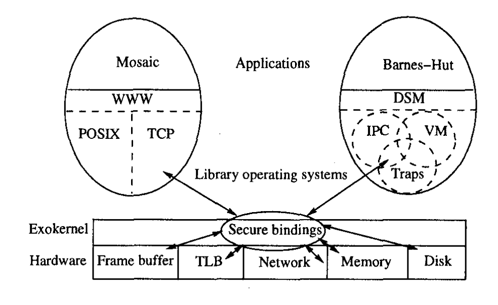

# Exokernels

The concept was first introduced by Dawson R. Engler in his 1995 paper [Exokernel: An Operating System Architecture for Application-Level Resource Management](https://people.eecs.berkeley.edu/~kubitron/courses/cs262a-F19/handouts/papers/engler95exokernel.pdf), it was a paradigm shift in which we normally think about operating systems. He claims that abstractions in traditional operating systems are expensive and restricts domain specific optimisations.

The idea of an *exokernel* is to provide a thin layer on top of raw hardware that does two things: **secure access** and **multiplexes resources**. As for abstractions such as filesystems, process scheduling, etc. would be offloaded to application-level libraries called *LibOS*. The diagram below depicts an implementation of the exokernel architecture.

<i>Figure 1.1.1: Exokernel Architecture</i>

As can be seen from the diagram, abstractions such as *POSIX*[^posix] or *TCP*[^tcp] lives in the user-space and they are basically plug-and-play by different applications. In other words, developers are free to write their own abstractionsand this opens up opportunity for building highly customised abstractions tailored to domain-specific use cases and machine capabilities.

[^posix]: [Portable Operating System Interface (POSIX)](https://en.wikipedia.org/wiki/POSIX) is a family of standards specified by the IEEE Computer Society for maintaining compatibility between operating systems.

[^tcp]: [Transmission Control Protocol (TCP)](https://en.wikipedia.org/wiki/Transmission_Control_Protocol) is one of the main protocols of the Internet protocol suite. It originated in the initial network implementation in which it complemented the Internet Protocol. Therefore, the entire suite is commonly referred to as TCP/IP.

## Difference between hypervisors

*TODO*
At first glance, *exokernel* seems to resembles the purpose of a hypervisor on a high-level but ... 

## Advantages of being close to the hardware

The performance for highly optimised systems would be incredible since they are no longer bottlenecked by the software layer. This would be beneficial to applications that run in isolation such as supercomputers, or highly-customised server-side applications. 

Training machine learning models would make a good use case as it usually needs a lot of hardware resources and normally does not interact with the outside world except the initial stage where data is fed. Other than that, utilising *exokernel* for quantum computers would really make sense as developers would want to leverage the maximum capacity of the CPU and normally quantum computers are used for very specific computing such as cryptography.

In short, it would be good for anything that doesn't require general purpose computing.

## What's the catch? 

Almost everything comes with a compromise and there is no exception for *exokernel*. The biggest issue would be the lack of common standards and this makes even doing simple things such as opening a file difficult. That is why *exokernel* would be a bad idea for general-purpose operating system.

In addition, different *LibOS* would have different implementations and the result is cross-platform development would be very difficult if not impossible. To give a counterexample, because most devices runs Linux nowadays such as android phones, laptops, as such. Their filesystems abstraction is the similar and would allow for reusable application code.

## Interesting use cases for *exokernel*

Due to the fact that components are loosely coupled, it is easier to test new OS-level features such as filesystems, scheduling techniques, etc. Because these abstractions can be implemented at the *LibOS* level, which is easily swappable and has a lower chance of crashing the kernel.

## Comparison with other type of kernels

*TODO*
- microkernels
- monolithic kernels

## Related Links 🔗

- [🌐 Exokernel - OSDev Wiki](https://wiki.osdev.org/Exokernel)
- [📚 Exokernel: An Operating System Architecture for Application-Level Resource Management](https://people.eecs.berkeley.edu/~kubitron/courses/cs262a-F19/handouts/papers/engler95exokernel.pdf)
- [🎥 Video Summary of the paper: "Exokernel: An Operating System Architecture for Application-Level Resource Management"](https://youtu.be/TZB60F5kNSk)
- [🖼 Lecture Slides from MIT](https://pdos.csail.mit.edu/archive/exo/exo-slides/sld001.htm)
